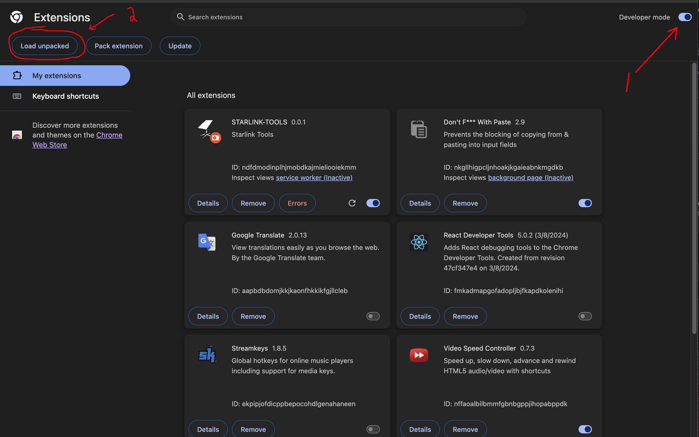
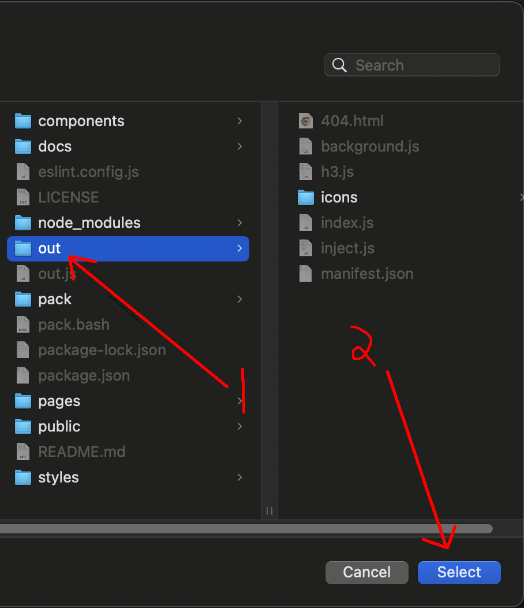

# Starlink management tools  🚀  

## Features

### Terminal Geo location

You must install the extension and then go to your device detail. There you will see two buttons that were added

- View the actual location of the dish. If you click on "View in Map" you will be redirected to a Google Maps map that contains the central location of cell H3 where said antenna is.

- See the H3 cell assigned to your dish. If you click there, the GeoJSON polygon of cell H3 will be copied to your clipboard and then the GeoJSON page will open so you can proceed to paste the value and view the cell

#### How does it work?

Within the telemetry data obtained from the page, the id of cell H3 where the antenna is located is encoded. This does not give us an exact result, but it allows us to know approximately where it is located.

## Installation

Download or clone this project and then follow the steps below:

1. Unzip the project
2. Go to `chrome://extensions/` and enable the developer mode.

3. Click on "Load unpacked" and select the 'out' folder where the project was unzipped
4. 

